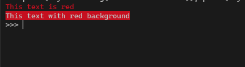
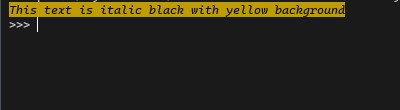

<h1 align="center">Ansie</h1>
<p align="center">
	Python library that makes working with ANSI ESC easy and enjoyable.
	<br/><br/>
	<a href="#">
		
	</a>
</p>
<br/>

- [Why should you use Ansie?](#why-should-you-use-ansie)
- [Information](#information)
- [License](#license)

<br/>

## Why should you use Ansie?

### It's easy

<div style="display:flex">
<div style="width:400px;padding-right:0.5em">

##### Input

```py
from ansie import styles
print(styles.red.fg('This text is red'))
print(styles.red.bg('This text with red background'))
```

</div>
<div style="width:400px;padding-left:0.5em">

##### Output


</div>
</div>

### It's powerful

<div style="display:flex">
<div style="width:400px;padding-right:0.5em">

##### Input

```py
from ansie import styles
union = styles.black.fg + styles.yellow.bg + styles.italic
print(union('This text is bold black with yellow background'))
```

</div>
<div style="width:400px;padding-left:0.5em">

##### Output


</div>
</div>

<br/>

*Note: Other examples can be found [here](../examples/).*

## Information

### Documentation
You can found this [here](./DOCS.md).

### Requirements
- Python `>= 3.6`
- ~~Hands~~

### Installation
Using pip:

```
pip install ansie
```

or locally:

```
git clone https://github.com/Rebzzel/ansie.git
cd ansie
pip install .
```


## License
```
MIT License

Copyright (c) 2014-2022 Rebzzel

Permission is hereby granted, free of charge, to any person obtaining a copy
of this software and associated documentation files (the "Software"), to deal
in the Software without restriction, including without limitation the rights
to use, copy, modify, merge, publish, distribute, sublicense, and/or sell
copies of the Software, and to permit persons to whom the Software is
furnished to do so, subject to the following conditions:

The above copyright notice and this permission notice shall be included in all
copies or substantial portions of the Software.

THE SOFTWARE IS PROVIDED "AS IS", WITHOUT WARRANTY OF ANY KIND, EXPRESS OR
IMPLIED, INCLUDING BUT NOT LIMITED TO THE WARRANTIES OF MERCHANTABILITY,
FITNESS FOR A PARTICULAR PURPOSE AND NONINFRINGEMENT. IN NO EVENT SHALL THE
AUTHORS OR COPYRIGHT HOLDERS BE LIABLE FOR ANY CLAIM, DAMAGES OR OTHER
LIABILITY, WHETHER IN AN ACTION OF CONTRACT, TORT OR OTHERWISE, ARISING FROM,
OUT OF OR IN CONNECTION WITH THE SOFTWARE OR THE USE OR OTHER DEALINGS IN THE
SOFTWARE.
```
